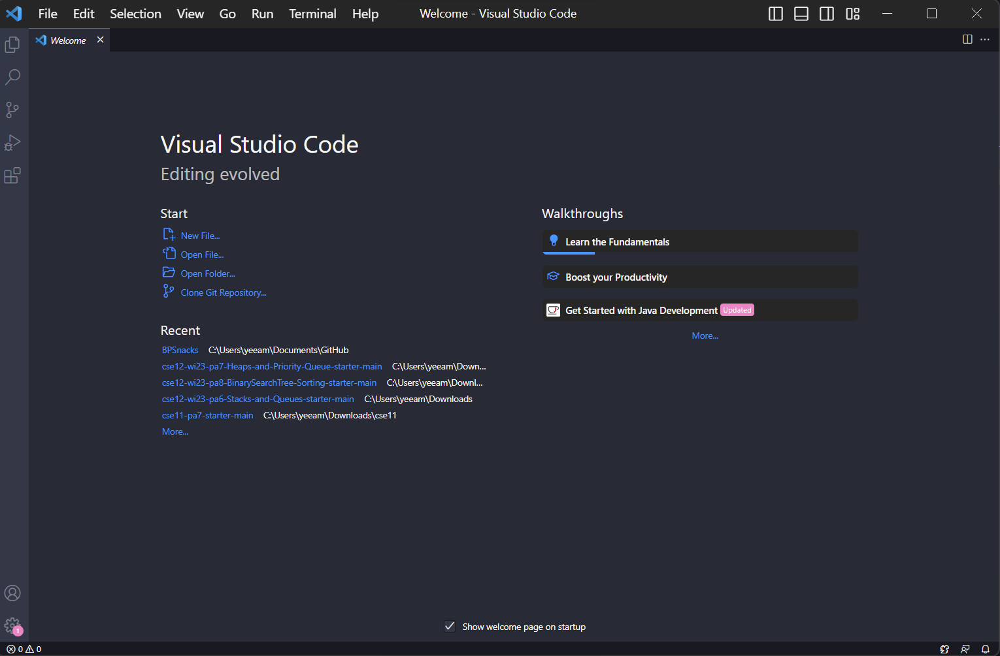
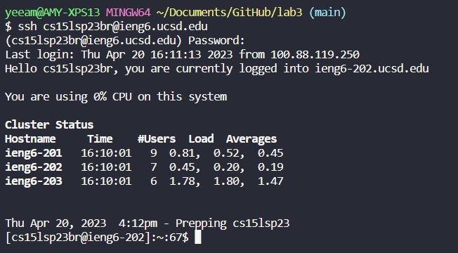
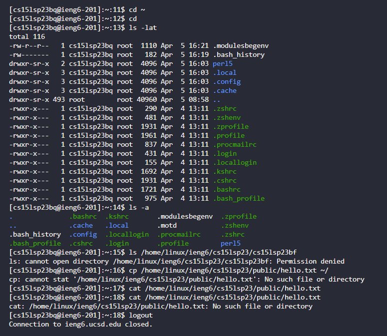
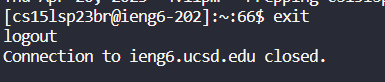

# Lab Report 1

The first step in logging into the course-specific account on `ieng` would be to install VSCode. I already had VSCode on my device, but this is what it should look like when opening VSCode.

Download VSCode [here](https://code.visualstudio.com/download).

---

For remotely connecting, I first set up `git bash` in VSCode. I then opened a new terminal and set it to bash instead of powershell. In that new terminal, I then typed the command `ssh cse15lsp23br@ieng6.ucsd.edu` into the terminal. `sp23` should be replaced by your current quarter and year, and `br` should be replaced by the letters in *your* course specific account.

After typing this command, the terminal asks if you want to connect to the server. Type `yes` and continue. You are then prompted to type in your password for the course specific account. The terminal does not show the characters as you type it in, so just type the password and press enter. After entering my password, the following was shown. I struggled with logging in at first because I had changed my AD password rather than setting the course specific account password.

---

The last step was to try some commands. The following were the commands that were used.

* `cd ~`
* `cd`
* `ls -lat`
* `ls -a`
* `ls /home/linux/ieng6/cs15lsp23/cs15lsp23zz`
* `cp /home/linux/ieng6/cs15lwi23/public/hello.txt ~/`
* `cat /home/linux/ieng6/cs15lwi23/public/hello.txt`

The following image displays the results from the commands:

As shown in the image above,

`cd ~` changes the current directory to the home directory, but has no visible change because the home directory is the current directory.

`cd` will not do anything by itself, but when paired with a directory, it will change the directory to the one behind this command.

`ls -lat` will list the files in the current directory in the long format.

`ls -a` will list the hidden files in the current directory.

`ls /home/linux/ieng6/cs15lsp23/cs15lsp23zz` tries to access the directory of another student, but results in denied access since you do not have access to another student's directory.

`cp /home/linux/ieng6/cs15lwi23/public/hello.txt ~/` will copy the file after the `cp` command.

`cat /home/linux/ieng6/cs15lwi23/public/hello.txt` will concatenate the files after the `cat` command and display the result, which in this case just shows the text in the hello.txt file.

---

After these commands, CTRL + D or simply typing "exit" will log you out of the server.
