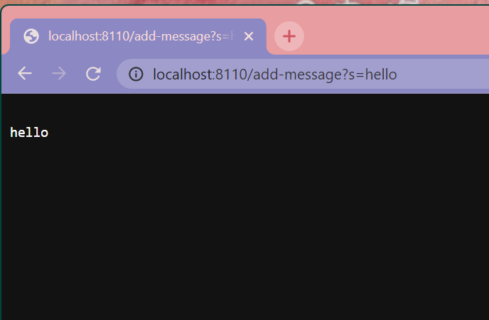
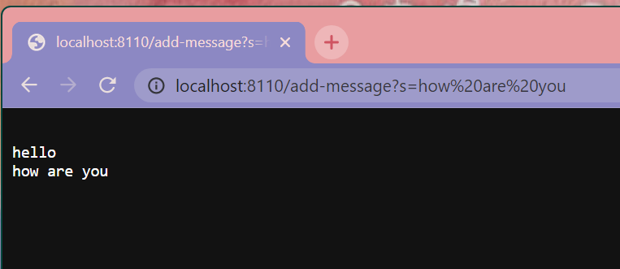
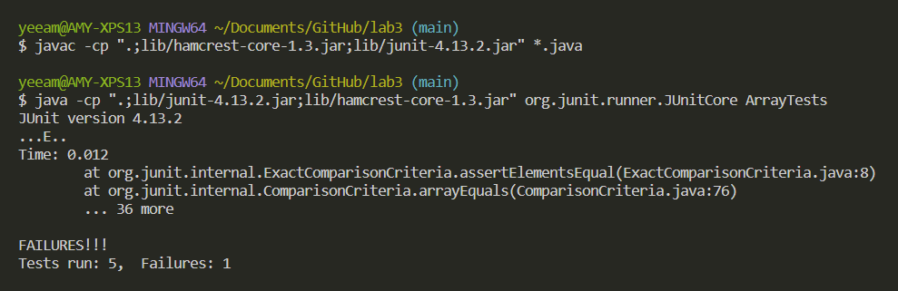

# Part One: StringServer

Here is my code for the StringServer:

``` java
import java.io.IOException;
import java.net.URI;

class Handler implements URLHandler {

    String strings = "";

    public String handleRequest(URI url) {

        if (url.getPath().equals("/")) {
            return strings;
        } else if(url.getPath().equals("/add-message")) {
            String[] parameters = url.getQuery().split("=");
            if (parameters[0].equals("s")) {
                strings = String.join("\n", strings, parameters[1]);
                return strings;
            }
        }
        return "404 Not Found!";
    }
}

class StringServer {
    public static void main(String[] args) throws IOException {

        if(args.length == 0){
            System.out.println("Missing port number! Try any number between 1024 to 49151");
            return;
        }

        int port = Integer.parseInt(args[0]);

        Server.start(port, new Handler());
    }
}
```
Here is the code to start the server, taken from the wavelet in lab 1.

``` java
// A simple web server using Java's built-in HttpServer

// Examples from https://dzone.com/articles/simple-http-server-in-java were useful references

import java.io.IOException;
import java.io.OutputStream;
import java.net.InetSocketAddress;
import java.net.URI;

import com.sun.net.httpserver.HttpExchange;
import com.sun.net.httpserver.HttpHandler;
import com.sun.net.httpserver.HttpServer;

interface URLHandler {
    String handleRequest(URI url);
}

class ServerHttpHandler implements HttpHandler {
    URLHandler handler;
    ServerHttpHandler(URLHandler handler) {
      this.handler = handler;
    }
    public void handle(final HttpExchange exchange) throws IOException {
        // form return body after being handled by program
        try {
            String ret = handler.handleRequest(exchange.getRequestURI());
            // form the return string and write it on the browser
            exchange.sendResponseHeaders(200, ret.getBytes().length);
            OutputStream os = exchange.getResponseBody();
            os.write(ret.getBytes());
            os.close();
        } catch(Exception e) {
            String response = e.toString();
            exchange.sendResponseHeaders(500, response.getBytes().length);
            OutputStream os = exchange.getResponseBody();
            os.write(response.getBytes());
            os.close();
        }
    }
}

public class Server {
    public static void start(int port, URLHandler handler) throws IOException {
        HttpServer server = HttpServer.create(new InetSocketAddress(port), 0);

        //create request entrypoint
        server.createContext("/", new ServerHttpHandler(handler));

        //start the server
        server.start();
        System.out.println("Server Started! Visit http://localhost:" + port + " to visit.");
    }
}
```

The first method in my code is `public String handleRequest(URI url)`, which uses the path in the url to add messages and display them. If the url path has is `/add-message`, the string in the query after `s=` is concatenated into a string which is then returned to the page. If the url path is `/`, the added strings will be shown on the page. The url path and query are used as arguments in this method.

The other method in my code is `public static void main(String[] args) throws IOException`, which starts the server with the argument as the port. If there is no argument for the port, the server does not start and a message is printed out into the terminal. When given an argument, the server starts with the argument as its port.


Here is what the `/add-message` looks like after adding one message:





Here is what the `/add-message` looks like after adding two messages:




---
# Part 2: Bugs

The bug that I chose is the bug in `reverseInPlace`.

Here is the JUnit test that has a failure-inducing input into the original method for `reverseInPlace`:
``` java
@Test
  public void testReverseInPlaceCustom() {
    int[] input1 = {1, 2, 3};
    ArrayExamples.reverseInPlace(input1);
    assertArrayEquals(new int[]{3, 2, 1}, input1);
  }
 ```
 
Here is the JUnit test that does not induce a failure into the original method for `reverseInPlace`:
```java
@Test 
  public void testReverseInPlace() {
    int[] input1 = { 3 };
    ArrayExamples.reverseInPlace(input1);
    assertArrayEquals(new int[]{ 3 }, input1);
  }
```

Here is the symptom as an output of running the tests:


Here is the code before fixing:
```java
  static void reverseInPlace(int[] arr) {

    for(int i = 0; i < arr.length; i += 1) {
      arr[i] = arr[arr.length - i - 1];
    }
  }
```

Here is the code after fixing:
```java
  static void reverseInPlace(int[] arr) {
  
    for (int i = 0; i < arr.length / 2; i++) {
      int e = arr[i];
      arr[i] = arr[arr.length - i - 1];
      arr[arr.length - i - 1] = e;
    }
  }
```
The before code replaces the value at the front with the value at the end, but does not set the end value to the front value until it gets to the end, which replaces the end value with the front's new value, creating a palindrome rather than a reversed array. The after code stores the front value before replacing it with the end value and then replacing the end value with the stored value. The code also only goes halfway across the array so that it does not overwrite the new front and end values.

---

# Part 3
In weeks 2 and 3, I learned how to use Github desktop to commit and pull code. I don't have a lot of experience using Github so it was interesting to clone repositories and open the code with VSCode. While I still don't know how to use Github to its full extent, I hope to get more used to the different commands.
