# Lab Report 4: Vim

## Step 4: Log into ieng6

To login into ieng6, I typed `ssh cs15lsp23br@ieng6.ucsd.edu <enter>`. Since I have an SSH key set up for my computer, I didn't have to type in my password.

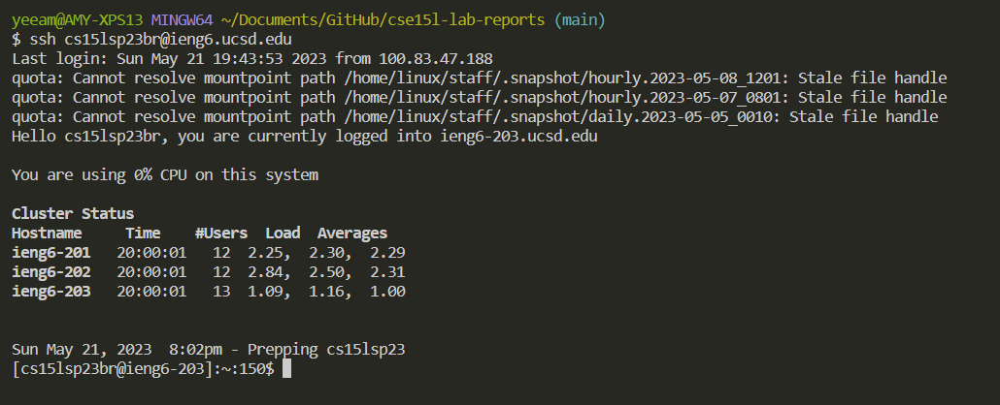

---

## Step 5: Clone your fork of the repository from your Github account

I cloned the github fork using `git clone git@github.com:aym-ie/lab7.git <enter>`, where the Github link was the SSH link to the fork of the repository from my Github account.

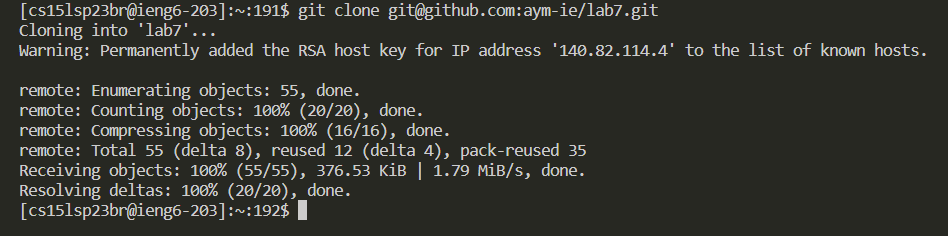

---

## Step 6: Run the tests, demonstrating that they fail

Before running the tests, I needed to change the directory to the lab using `cd lab7 <enter>`. I checked the files in the directory using `ls`. To run the test file, I typed `bash test.sh <enter>`.

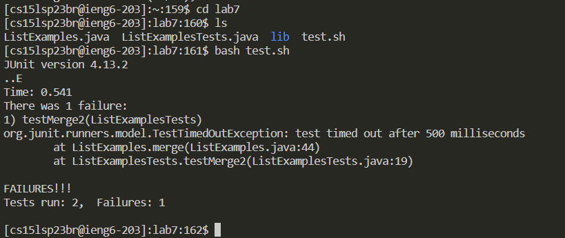

---

## Step 7: Edit the code file `ListExamples.java` to fix the failing test

To open `ListExamples.java`, I typed `vim ListExamples.java <enter>`.

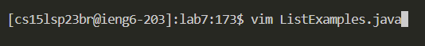

This resulted in viewing `ListExamples.java` in normal mode.

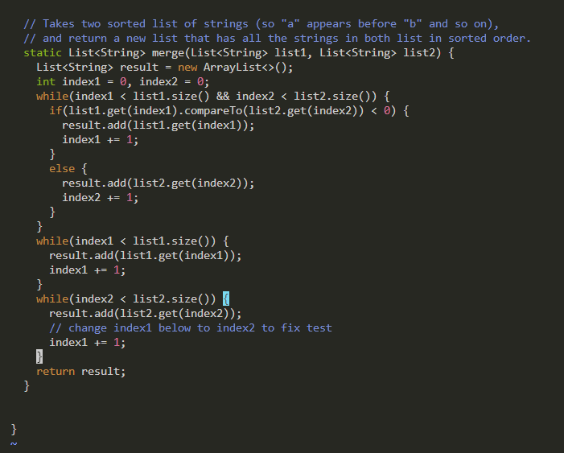

Starting from the bottom of the file by clicking my mouse (the closing bracket), I used `<up> <up> <up> <up> <up> <up> a <right> <right> <right> <right> <right> <right> <right> <right> <right> <right> <delete> 2` to edit the file and change the last `index1` into `index2`. I used `a` to append `index1`, entering insert mode to delete the `1` and replace it with a `2`.

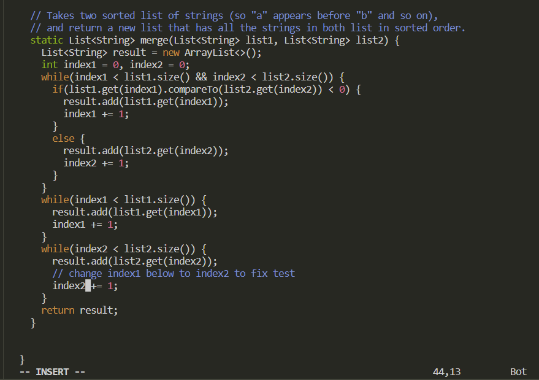

I used `<escape>` to get back into normal mode and `:wq <enter>` to save and exit the file.

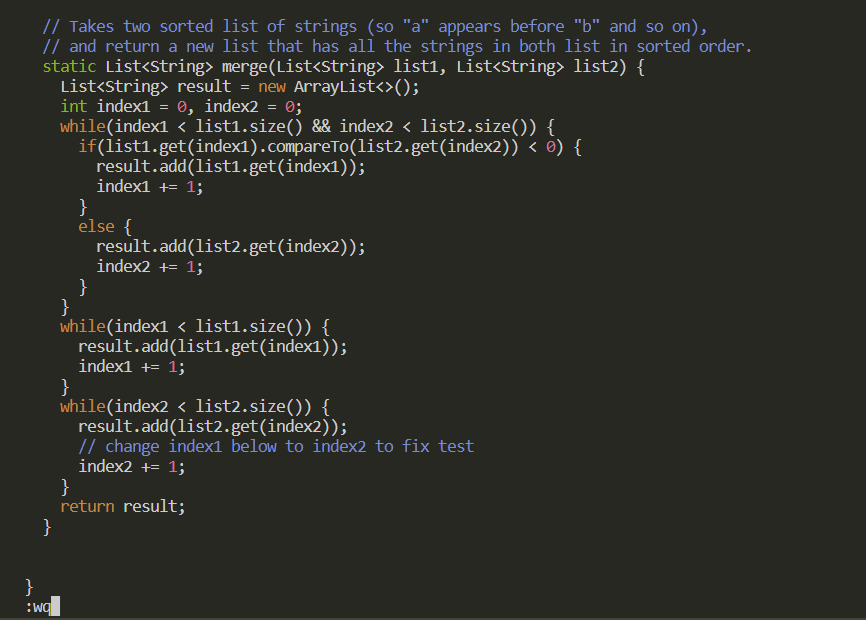

---

## Step 8: Run the tests, demonstrating that they now succeed

I then typed `bash test.sh <enter>` to run the tests again, which passed.

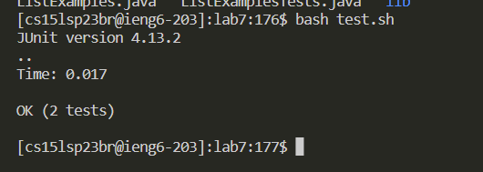

---

## Step 9: Commit and push the resulting change to your Github account

I first added `ListExamples.java` using `git add ListExamples.java <enter>` before using `git commit <enter>`.

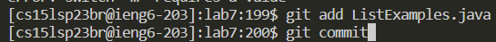

After using `git commit <enter>`, the following commit file appears.

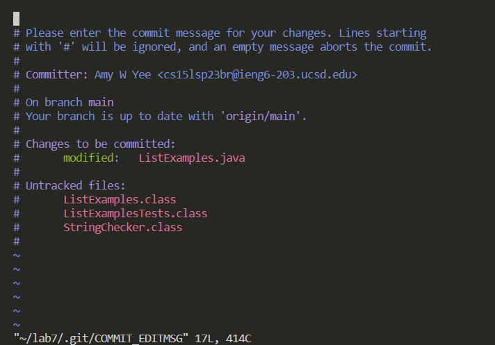

To edit the commit message, I pressed `i` to enter insert mode before typing out the commit message above the rows with `#`.

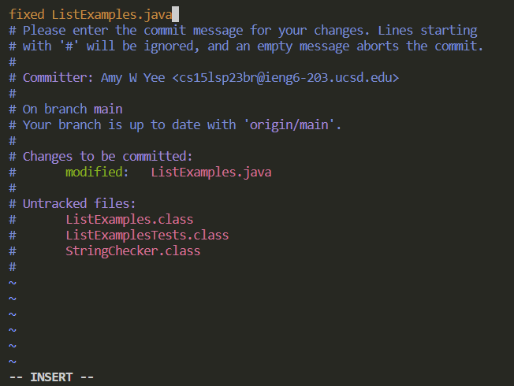

I then pressed `<escape>` to go back to normal mode before typing `:wq` to save and exit the commit message.

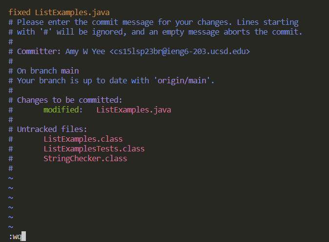

This is what appears after pressing `<enter>` after the `:wq`.

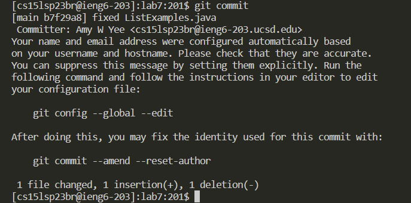

After finishing the commit, I typed `git push` to push the changes to my Github account.

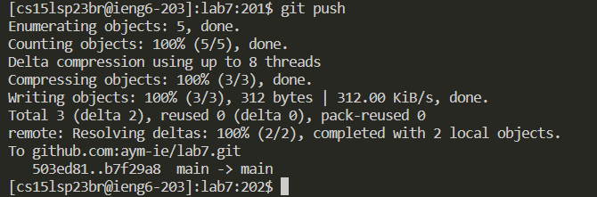
