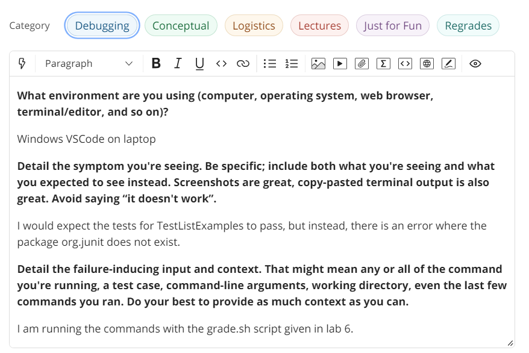
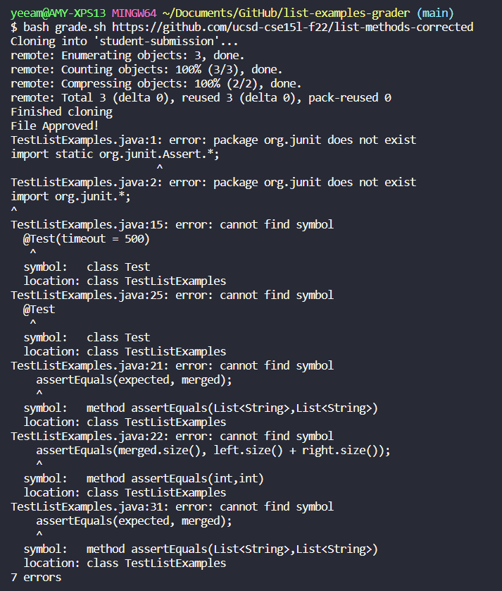
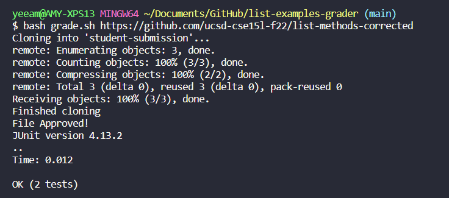
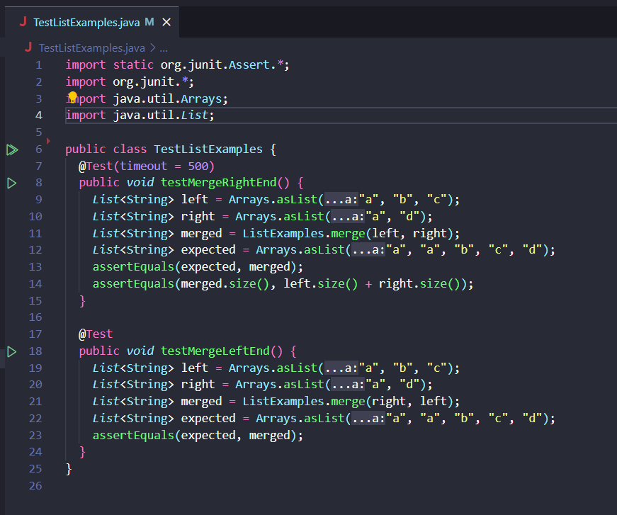

# Lab Report 5: Debugging

## Part 1: Debugging Scenario


### Step 1: Student EdStem Post

In this scenario, the edstem post would look like the image below. The output is from Windows VSCode and the code from lab 6, the grading script. The terminal command used was:

`bash grade.sh https://github.com/ucsd-cse15l-f22/list-methods-corrected`




The image below contains the output and error from the command, where the junit package does not exist.




### Step 2: TA Response

The TA response to this question could be:

What command are you using to compile and run the file in the bash script? Double check that everything needed is in the working directory and that the commands match the Windows OS. 

As a reminder, the compile and run command for Windows is:
```bash
$ javac -cp '.;lib/hamcrest-core-1.3.jar;lib/junit-4.13.2.jar' *.java
$ java -cp '.;lib/junit-4.13.2.jar;lib/hamcrest-core-1.3.jar' org.junit.runner.JUnitCore <file name>
```

### Step 3: Trying the TA Suggestions

Using the TA suggestions, the image below is the output of the terminal when running the same bash script command. The tests passed. The bug was that instead of using the windows command for running and compiling the java files, the macOS commands were used, so the JUnit packags were not recognized.



### Step 4: Setup Information


This bug is based off of lab 6, the grading script from lab. For the file and directory structure, in order to compile and run the files, the files all need to be in the working directory. The library for the JUnit, the test files, and the student submission files need to be in the working directory for the tests to run properly.


The screenshot below shows the contents for each file before the bug was fixed.

grade.sh:


testListExamples.java:




The full command to trigger the bug was:
`bash grade.sh https://github.com/ucsd-cse15l-f22/list-methods-corrected`


To fix the bug, the JUnit java commands need to be for the Windows OS, not macOS. By changing the format of the java compile and run commands in `grade.sh`, the bug is fixed.

---

## Part 2: Reflection


I learned a lot about using the terminal to do things. Before this class, I only used the terminal to run and compile tests. Now, I know how to create and edit files from the terminal directly. I also know more about how to use Github.